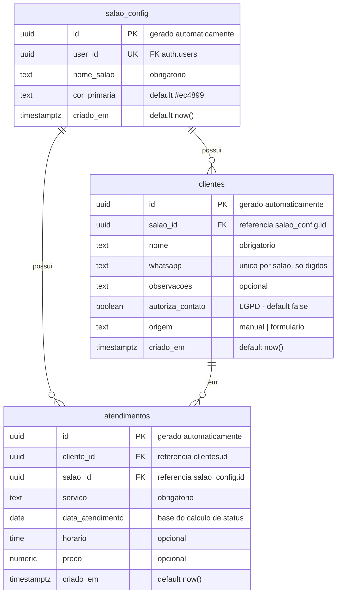

# ERD — Sistema de Gestão e Reativação de Clientes

**Versão:** 1.1
**Banco:** Supabase (PostgreSQL)
**Última atualização:** 12/06/2026

Este documento descreve o modelo de dados do sistema. O diagrama abaixo (Mermaid) renderiza automaticamente no GitHub. Logo depois vem o SQL pronto para rodar no SQL Editor do Supabase.

---

## 1. Diagrama (ERD)



**Leitura das relações:**
- Um `salao_config` possui **zero ou muitos** `clientes` e `atendimentos` (1:N)
- Uma `cliente` tem **zero ou muitos** `atendimentos` (1:N)
- Cada `atendimento` pertence a exatamente uma `cliente` e a exatamente um `salao_config`

---

## 2. Entidades

### `salao_config`

Configuração do salão — uma linha por deploy. Vincula o `user_id` do Supabase Auth ao salão e armazena as configurações visuais.

| Coluna | Tipo | Restrição | Observação |
|--------|------|-----------|------------|
| `id` | uuid | PK | gerado automaticamente |
| `user_id` | uuid | UNIQUE, NOT NULL, FK → `auth.users` | usuário autenticado (dona) |
| `nome_salao` | text | NOT NULL | exibido no formulário público |
| `cor_primaria` | text | NOT NULL, default `#ec4899` | hex — cor do cabeçalho |
| `criado_em` | timestamptz | default now() | data de implantação |

### `clientes`

Representa a pessoa atendida no salão. É a entidade de identidade — uma linha por cliente por salão, nunca duplicada dentro do mesmo salão.

| Coluna | Tipo | Restrição | Observação |
|--------|------|-----------|------------|
| `id` | uuid | PK | gerado automaticamente |
| `salao_id` | uuid | NOT NULL, FK → `salao_config.id` | **chave de isolamento** — toda query de RLS filtra por aqui |
| `nome` | text | NOT NULL | nome da cliente |
| `whatsapp` | text | NOT NULL | **chave de deduplicação** — armazenar normalizado (só dígitos); unique por `(whatsapp, salao_id)` |
| `observacoes` | text | — | preferências, alergias, etc. (opcional) |
| `autoriza_contato` | boolean | NOT NULL, default false | LGPD — consentimento para contato via WhatsApp |
| `origem` | text | NOT NULL, default `'manual'` | `'manual'` (dona cadastrou) ou `'formulario'` (cliente usou o formulário público) |
| `criado_em` | timestamptz | default now() | data de cadastro |

### `atendimentos`

Representa cada visita/serviço realizado. Uma cliente acumula vários ao longo do tempo — é isso que forma o **histórico** e permite calcular a última visita.

| Coluna | Tipo | Restrição | Observação |
|--------|------|-----------|------------|
| `id` | uuid | PK | gerado automaticamente |
| `cliente_id` | uuid | NOT NULL, FK → `clientes.id` | dono do atendimento |
| `salao_id` | uuid | NOT NULL, FK → `salao_config.id` | **chave de isolamento** — redundante com `clientes.salao_id` mas necessária para as policies de RLS |
| `servico` | text | NOT NULL | ex.: manicure, pé, alongamento |
| `data_atendimento` | date | NOT NULL | **base do cálculo de status** |
| `horario` | time | — | horário do atendimento (opcional) |
| `preco` | numeric(10,2) | — | valor cobrado (opcional) |
| `criado_em` | timestamptz | default now() | quando o registro foi inserido |

---

## 3. Decisões de modelagem (por quê)

- **Duas tabelas de dados + uma de config.** `clientes` e `atendimentos` são os dados de negócio; `salao_config` é infraestrutura de deploy.
- **`salao_id` em ambas as tabelas.** O RLS precisa do `salao_id` diretamente na linha para filtrar sem JOINs nas policies. Redundante, mas necessário para policies simples e performáticas.
- **`(whatsapp, salao_id)` como unique constraint.** O mesmo número de WhatsApp pode existir em salões diferentes (projetos distintos ou futuro multi-tenant). Dentro de um salão, o número continua sendo a chave de deduplicação.
- **Status NÃO é coluna.** Verde/amarelo/vermelho é derivado de `MAX(data_atendimento)` em tempo de leitura via view. Nunca fica desatualizado com a passagem dos dias.
- **`autoriza_contato` como coluna, não flags.** Booleano simples — basta para o compliance LGPD do MVP. Sem tabela de consentimentos auditável por enquanto (Fase 2+).
- **`origem` para rastrear canal.** Permite futuramente segmentar clientes que se cadastraram pelo formulário público vs. cadastradas pela dona.

---

## 4. SQL — criação do schema completo

Cole no **SQL Editor** do Supabase e execute para um novo salão.

```sql
-- Extensão para gerar UUIDs (geralmente já habilitada no Supabase)
create extension if not exists "pgcrypto";

-- =========================
-- Tabela: salao_config
-- =========================
create table if not exists public.salao_config (
  id           uuid        primary key default gen_random_uuid(),
  user_id      uuid        not null unique references auth.users(id) on delete cascade,
  nome_salao   text        not null,
  cor_primaria text        not null default '#ec4899',
  criado_em    timestamptz not null default now()
);

-- =========================
-- Tabela: clientes
-- =========================
create table if not exists public.clientes (
  id               uuid        primary key default gen_random_uuid(),
  salao_id         uuid        not null references public.salao_config(id) on delete cascade,
  nome             text        not null,
  whatsapp         text        not null,   -- armazenar normalizado (só dígitos)
  observacoes      text,
  autoriza_contato boolean     not null default false,
  origem           text        not null default 'manual',  -- 'manual' | 'formulario'
  criado_em        timestamptz not null default now(),
  constraint clientes_whatsapp_salao_unique unique (whatsapp, salao_id)
);

-- =========================
-- Tabela: atendimentos
-- =========================
create table if not exists public.atendimentos (
  id               uuid         primary key default gen_random_uuid(),
  cliente_id       uuid         not null references public.clientes(id) on delete cascade,
  salao_id         uuid         not null references public.salao_config(id) on delete cascade,
  servico          text         not null,
  data_atendimento date         not null default current_date,
  horario          time,
  preco            numeric(10,2),
  criado_em        timestamptz  not null default now()
);

-- Índice para acelerar a busca da última visita por cliente
create index if not exists idx_atendimentos_cliente_data
  on public.atendimentos (cliente_id, data_atendimento desc);

-- Índice para acelerar queries filtradas por salao_id
create index if not exists idx_clientes_salao
  on public.clientes (salao_id);

create index if not exists idx_atendimentos_salao
  on public.atendimentos (salao_id);
```

---

## 5. View de status (verde / amarelo / vermelho)

Esta view calcula a última visita e o status de cada cliente automaticamente. O frontend pode simplesmente fazer `select * from clientes_status order by dias_desde_ultima_visita desc`.

> O `security_invoker = true` garante que o RLS das tabelas base é avaliado no contexto de quem consulta a view — sem ele, a view rodar com as permissões do criador e bypass o RLS.

```sql
create or replace view public.clientes_status
  with (security_invoker = true)
as
select
  c.id,
  c.nome,
  c.whatsapp,
  c.observacoes,
  c.autoriza_contato,
  c.salao_id,
  max(a.data_atendimento)                                as ultima_visita,
  (current_date - max(a.data_atendimento))::int          as dias_desde_ultima_visita,
  case
    when max(a.data_atendimento) is null        then 'sem_atendimento'
    when current_date - max(a.data_atendimento) <= 30 then 'verde'
    when current_date - max(a.data_atendimento) <= 60 then 'amarelo'
    else 'vermelho'
  end                                                    as status,
  (
    select servico from public.atendimentos
    where cliente_id = c.id
    order by data_atendimento desc
    limit 1
  )                                                      as ultimo_servico
from public.clientes c
left join public.atendimentos a on a.cliente_id = c.id
group by c.id;
```

**Regra das bordas (documentada para não dar ambiguidade):**

| Dias desde a última visita | Status |
|----------------------------|--------|
| 0 a 30 | 🟢 verde |
| 31 a 60 | 🟡 amarelo |
| 61 ou mais | 🔴 vermelho |
| nenhum atendimento ainda | ⚪ sem_atendimento — não entra na reativação |

---

## 6. Segurança (RLS)

As policies de RLS estão documentadas em `docs/RBAC-RLS.md`. O padrão adotado filtra por `salao_id`:

```sql
-- Exemplo de policy (ver RBAC-RLS.md para o script completo)
using (
  salao_id = (select id from public.salao_config where user_id = auth.uid())
)
```

Isso garante que cada usuário autenticado só enxerga as linhas do próprio salão — independente de haver outros salões no mesmo banco de dados (preparação para o multi-tenant da Fase 2).
