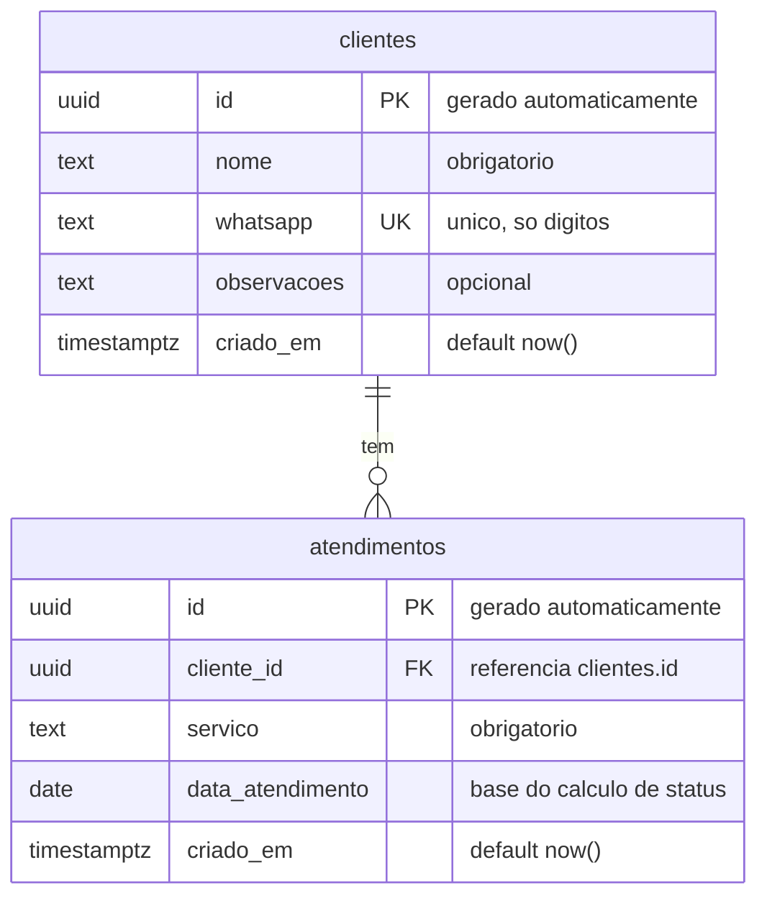

# ERD — Sistema de Gestão e Reativação de Clientes

**Versão:** 1.0 (MVP)
**Banco:** Supabase (PostgreSQL)
**Última atualização:** 10/06/2026

Este documento descreve o modelo de dados do sistema. O diagrama abaixo (Mermaid) renderiza automaticamente no GitHub. Logo depois vem o SQL pronto para rodar no SQL Editor do Supabase.

---

## 1. Diagrama (ERD)



**Leitura da relação:** uma `cliente` tem **zero ou muitos** `atendimentos` (1:N). Cada `atendimento` pertence a exatamente uma `cliente`.

---

## 2. Entidades

### `clientes`

Representa a pessoa atendida no salão. É a entidade de identidade — uma linha por cliente, nunca duplicada.

| Coluna | Tipo | Restrição | Observação |
|--------|------|-----------|------------|
| `id` | uuid | PK | gerado automaticamente |
| `nome` | text | NOT NULL | nome da cliente |
| `whatsapp` | text | UNIQUE, NOT NULL | **chave de deduplicação** — armazenar normalizado (só dígitos) |
| `observacoes` | text | — | preferências, alergias, etc. (opcional) |
| `criado_em` | timestamptz | default now() | data de cadastro |

### `atendimentos`

Representa cada visita/serviço realizado. Uma cliente acumula vários ao longo do tempo — é isso que forma o **histórico** e permite calcular a última visita.

| Coluna | Tipo | Restrição | Observação |
|--------|------|-----------|------------|
| `id` | uuid | PK | gerado automaticamente |
| `cliente_id` | uuid | FK → `clientes.id` | dono do atendimento |
| `servico` | text | NOT NULL | ex.: manicure, pé, alongamento |
| `data_atendimento` | date | NOT NULL | **base do cálculo de status** |
| `criado_em` | timestamptz | default now() | quando o registro foi inserido |

---

## 3. Decisões de modelagem (por quê)

- **Duas tabelas, não uma.** Separar `clientes` de `atendimentos` permite manter histórico (N atendimentos por cliente) e calcular a "última visita" como `MAX(data_atendimento)`. Cadastrar atendimento de cliente existente = inserir uma linha em `atendimentos`, sem tocar em `clientes`.
- **`whatsapp` como chave única.** É o identificador real da cliente. Evita duplicatas. **Sempre normalizar para só dígitos** antes de inserir/comparar — senão a mesma pessoa vira duas linhas por causa de formatação.
- **Status NÃO é coluna.** Verde/amarelo/vermelho é derivado de `MAX(data_atendimento)` em tempo de leitura (via view ou no frontend). Assim nunca fica desatualizado com a passagem dos dias.

---

## 4. SQL — pronto para o Supabase

Cole no **SQL Editor** do Supabase e execute.

```sql
-- Extensão para gerar UUIDs (geralmente já habilitada no Supabase)
create extension if not exists "pgcrypto";

-- =========================
-- Tabela: clientes
-- =========================
create table if not exists public.clientes (
  id          uuid primary key default gen_random_uuid(),
  nome        text not null,
  whatsapp    text not null unique,   -- armazenar normalizado (só dígitos)
  observacoes text,
  criado_em   timestamptz not null default now()
);

-- =========================
-- Tabela: atendimentos
-- =========================
create table if not exists public.atendimentos (
  id               uuid primary key default gen_random_uuid(),
  cliente_id       uuid not null references public.clientes(id) on delete cascade,
  servico          text not null,
  data_atendimento date not null default current_date,
  criado_em        timestamptz not null default now()
);

-- Índice para acelerar a busca da última visita por cliente
create index if not exists idx_atendimentos_cliente_data
  on public.atendimentos (cliente_id, data_atendimento desc);
```

---

## 5. View de status (verde / amarelo / vermelho)

Esta view calcula a última visita e o status de cada cliente automaticamente. O frontend pode simplesmente fazer `select * from clientes_status order by dias_desde_ultima_visita desc`.

```sql
create or replace view public.clientes_status as
select
  c.id,
  c.nome,
  c.whatsapp,
  c.observacoes,
  max(a.data_atendimento)                                as ultima_visita,
  current_date - max(a.data_atendimento)                 as dias_desde_ultima_visita,
  case
    when max(a.data_atendimento) is null then 'sem_atendimento'
    when current_date - max(a.data_atendimento) <= 30 then 'verde'
    when current_date - max(a.data_atendimento) <= 60 then 'amarelo'
    else 'vermelho'
  end                                                    as status
from public.clientes c
left join public.atendimentos a on a.cliente_id = c.id
group by c.id, c.nome, c.whatsapp, c.observacoes;
```

**Regra das bordas (documentada para não dar ambiguidade):**

| Dias desde a última visita | Status |
|----------------------------|--------|
| 0 a 30 | 🟢 verde |
| 31 a 60 | 🟡 amarelo |
| 61 ou mais | 🔴 vermelho |
| nenhum atendimento ainda | (tratar como caso especial — sugestão: amarelo ou marcação própria) |

> Observação: clientes sem nenhum atendimento aparecem como `sem_atendimento`. Decida no frontend se elas entram na lista de reativação ou não (provavelmente não, já que nunca foram atendidas).

---

## 6. Segurança (RLS)

Ao habilitar **Row Level Security** no Supabase, defina as policies conforme o modelo de autenticação por salão. No modelo atual (uma instância/deploy por salão), o isolamento é simples, mas vale decidir cedo como a dona faz login antes de liberar acesso às tabelas.
